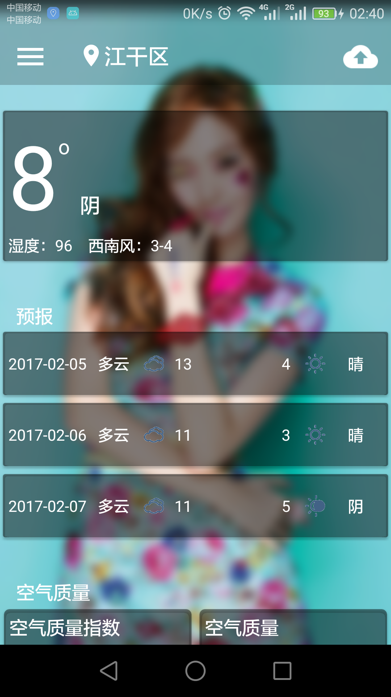
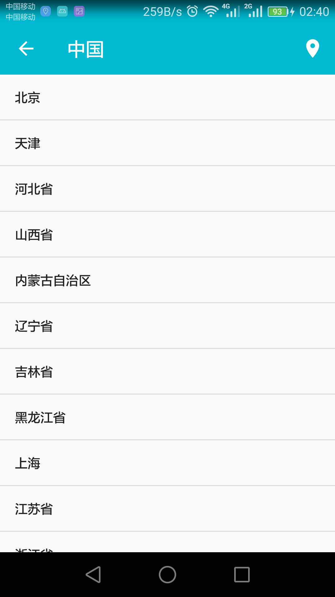
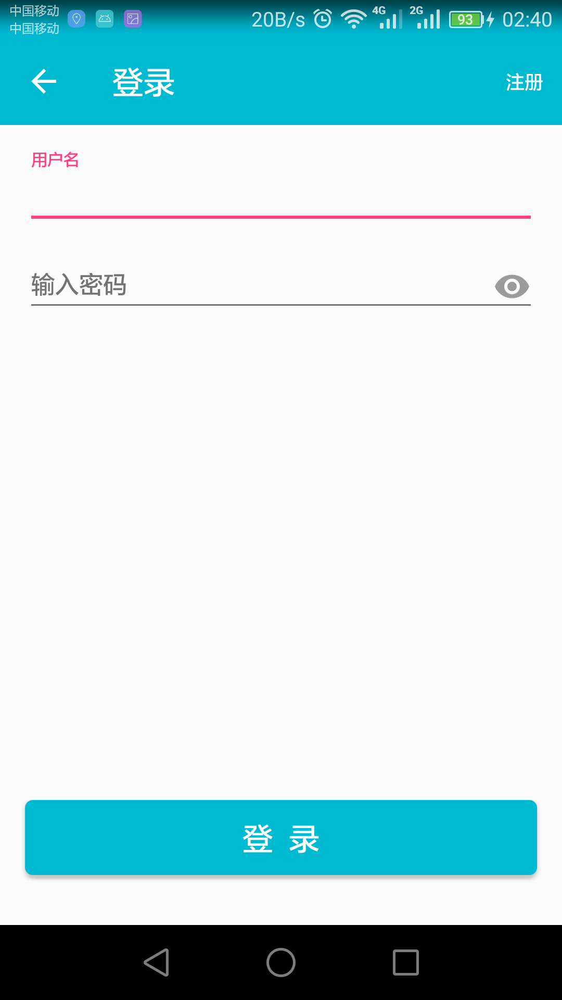
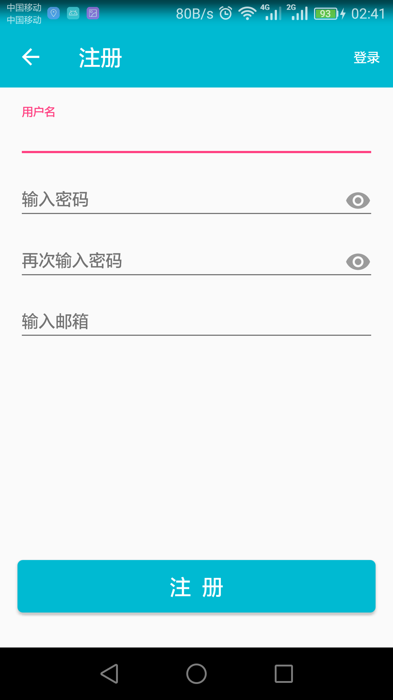

# MJWeather
[去应用市场下载](http://sj.qq.com/myapp/detail.htm?apkName=com.mj.weather)

   使用和风天气接口获取天气数据
   
   使用百度地图实现定位功能
   
   使用Mob的账户系统实现注册登录
   
   使用友盟统计实现账号统计、页面统计等
   
   网络框架使用OKHttp
   
   图片加载、处理框架使用Glide、glide-transformations
   
   数据库ORM框架使用Litepal
   
   数据解析使用gson
   
   权限处理使用EasyPermissions
   
   使用Material组件
   
    
# 截图

